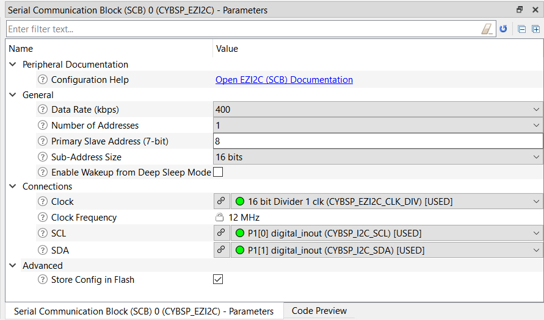

# PSoC&trade; 4 MCU: CAPSENSE&trade; with Flanking Sensor Suppression

*Disclaimer: This is a community code example (CCE) released for the benefit of the community users. These projects have only been tested for the listed BSPs, tools versions, and toolchains documented in this readme. They are intended to demonstrate how a solution / concept / use-case can be achieved on a particular device. For official code examples, please click [here](https://github.com/Infineon/Code-Examples-for-ModusToolbox-Software).*

This code example implements Flanking Sensor Suppression (FSS) in PSoC&trade; 4 devices. FSS eliminates false touches by distinguishing between signals from closely spaced buttons. In the project, three sensors have been used to demonstrate FSS. Whenever multiple sensors are touched, only the sensor whose touch was detected first remains active, and the other sensors are rendered inactive, i.e., their touch (if any) is rendered invalid until the sensor whose touch was detected first is active. This eliminates sensors, which are closely spaced, from being falsely triggered at the same time.

## Requirements

- [ModusToolbox&trade; software](https://www.infineon.com/modustoolbox-software) v2.4

  **Note:** This code example version requires ModusToolbox&trade; software version 2.4 and may not be compatible with other versions.

- Board support package (BSP) minimum required version: 2.0.0
- Programming language: C
- Associated parts: [PSoC&trade; 4000S](https://www.infineon.com/dgdl/Infineon-PSoC_4_PSoC_4000S_Datasheet_Programmable_System-on-Chip_%28PSoC_%29-DataSheet-v15_00-EN.pdf?fileId=8ac78c8c7d0d8da4017d0eda97715cf1&utm_source=cypress&utm_medium=referral&utm_campaign=202110_globe_en_all_integration-datasheet) and [PSoC&trade; 4100S plus](https://www.infineon.com/dgdl/Infineon-PSOC_4_PSOC_4100S_PLUS_DATASHEET_PROGRAMMABLE_SYSTEM-ON-CHIP_%28PSOC%29-DataSheet-v11_00-EN.pdf?fileId=8ac78c8c7d0d8da4017d0ee556d86cff&utm_source=cypress&utm_medium=referral&utm_campaign=202110_globe_en_all_integration-datasheet)


## Supported toolchains (make variable 'TOOLCHAIN')

- GNU Arm&reg; embedded compiler v9.3.1 (`GCC_ARM`) - Default value of `TOOLCHAIN`

## Supported kits (make variable 'TARGET')

- [PSoC&trade; 4100S plus prototyping kit](https://www.infineon.com/CY8CKIT-149) (`CY8CKIT-149`) - Default value of `TARGET`
- [PSoC&trade; 4000S CAPSENSE&trade; prototyping kit](https://www.infineon.com/CY8CKIT-145-40xx) (`CY8CKIT-145-40XX`)

## Hardware setup

This example uses the board's default configuration. See the kit user guide to ensure that the board is configured correctly.

**Note:** The PSoC&trade;4 kits ship with KitProg2 installed. The ModusToolbox&trade; requires KitProg3. Before using this code example, make sure that the board is upgraded to KitProg3. The tool and instructions are available in the [Firmware Loader](https://github.com/Infineon/Firmware-loader) GitHub repository. If you do not upgrade, you will see an error like "unable to find CMSIS-DAP device" or "KitProg firmware is out of date".

## Software setup

This example requires no additional software or tools.

## Using the code example

Create the project and open it using one of the following:

<details><summary><b>In Eclipse IDE for ModusToolbox&trade; software</b></summary>

1. Click the **New Application** link in the **Quick Panel** (or, use **File** > **New** > **ModusToolbox Application**). This launches the [Project Creator](https://www.infineon.com/dgdl/Infineon-ModusToolbox_Project_Creator_Guide_3-UserManual-v01_00-EN.pdf?fileId=8ac78c8c7d718a49017d99bcabbd31e5) tool.

2. Pick a kit supported by the code example from the list shown in the **Project Creator - Choose Board Support Package (BSP)** dialog.

   When you select a supported kit, the example is reconfigured automatically to work with the kit. To work with a different supported kit later, use the [Library Manager](https://www.infineon.com/dgdl/Infineon-ModusToolbox_Library_Manager_User_Guide_3-UserManual-v01_00-EN.pdf?fileId=8ac78c8c7d718a49017d99ab34b831ce) to choose the BSP for the supported kit. You can use the Library Manager to select or update the BSP and firmware libraries used in this application. To access the Library Manager, click the link from the **Quick Panel**.

   You can also just start the application creation process again and select a different kit.

   If you want to use the application for a kit not listed here, you may need to update the source files. If the kit does not have the required resources, the application may not work.

3. In the **Project Creator - Select Application** dialog, choose the example by enabling the checkbox.

4. (Optional) Change the suggested **New Application Name**.

5. The **Application(s) Root Path** defaults to the Eclipse workspace which is usually the desired location for the application. If you want to store the application in a different location, you can change the *Application(s) Root Path* value. Applications that share libraries should be in the same root path.

6. Click **Create** to complete the application creation process.

For more details, see the [Eclipse IDE for ModusToolbox&trade; software user guide](https://www.infineon.com/dgdl/Infineon-ModusToolbox_2.4_User_Guide-UserManual-v01_00-EN.pdf?fileId=8ac78c8c7e7124d1017ed97e72563632) (locally available at *{ModusToolbox&trade; software install directory}/ide_{version}/docs/mt_ide_user_guide.pdf*).

</details>

<details><summary><b>In command-line interface (CLI)</b></summary>

ModusToolbox&trade; software provides the Project Creator as both a GUI tool and the command line tool, "project-creator-cli". The CLI tool can be used to create applications from a CLI terminal or from within batch files or shell scripts. This tool is available in the *{ModusToolbox&trade; software install directory}/tools_{version}/project-creator/* directory.

Use a CLI terminal to invoke the "project-creator-cli" tool. On Windows, use the command line "modus-shell" program provided in the ModusToolbox&trade; software installation instead of a standard Windows command-line application. This shell provides access to all ModusToolbox&trade; software tools. You can access it by typing `modus-shell` in the search box in the Windows menu. In Linux and macOS, you can use any terminal application.

This tool has the following arguments:

Argument | Description | Required/optional
---------|-------------|-----------
`--board-id` | Defined in the `<id>` field of the [BSP](https://github.com/Infineon?q=bsp-manifest&type=&language=&sort=) manifest | Required
`--app-id`   | Defined in the `<id>` field of the [CE](https://github.com/Infineon?q=ce-manifest&type=&language=&sort=) manifest | Required
`--target-dir`| Specify the directory in which the application is to be created if you prefer not to use the default current working directory | Optional
`--user-app-name`| Specify the name of the application if you prefer to have a name other than the example's default name | Optional

<br>

The following example will clone the "[CAPSENSE&trade; with Flanking Sensor Suppression](https://github.com/Infineon/cce-mtb-psoc4-capsense-fss)" application with the desired name "MyCapsenseFSS" configured for the *CY8CKIT-149* BSP into the specified working directory, *C:/mtb_projects*:

   ```
   project-creator-cli --board-id CY8CKIT-149 --app-id cce-mtb-psoc4-capsense-fss --user-app-name MyCapsenseFSS --target-dir "C:/mtb_projects"
   ```

**Note:** The project-creator-cli tool uses the `git clone` and `make getlibs` commands to fetch the repository and import the required libraries. For details, see the "Project creator tools" section of the [ModusToolbox&trade; software user guide](https://www.infineon.com/dgdl/Infineon-ModusToolbox_2.4_User_Guide-UserManual-v01_00-EN.pdf?fileId=8ac78c8c7e7124d1017ed97e72563632) (locally available at *{ModusToolbox&trade; software install directory}/docs_{version}/mtb_user_guide.pdf*).

</details>

<details><summary><b>In third-party IDEs</b></summary>

Use one of the following options:

- **Use the standalone [Project Creator](https://www.infineon.com/dgdl/Infineon-ModusToolbox_Project_Creator_Guide_3-UserManual-v01_00-EN.pdf?fileId=8ac78c8c7d718a49017d99bcabbd31e5) tool:**

   1. Launch Project Creator from the Windows Start menu or from *{ModusToolbox&trade; software install directory}/tools_{version}/project-creator/project-creator.exe*.

   2. In the initial **Choose Board Support Package** screen, select the BSP, and click **Next**.

   3. In the **Select Application** screen, select the appropriate IDE from the **Target IDE** drop-down menu.

   4. Click **Create** and follow the instructions printed in the bottom pane to import or open the exported project in the respective IDE.

<br>

- **Use command-line interface (CLI):**

   1. Follow the instructions from the **In command-line interface (CLI)** section to create the application, and then import the libraries using the `make getlibs` command.

   2. Export the application to a supported IDE using the `make <ide>` command.

   3. Follow the instructions displayed in the terminal to create or import the application as an IDE project.

For a list of supported IDEs and more details, see the "Exporting to IDEs" section of the [ModusToolbox&trade; software user guide](https://www.infineon.com/dgdl/Infineon-ModusToolbox_2.4_User_Guide-UserManual-v01_00-EN.pdf?fileId=8ac78c8c7e7124d1017ed97e72563632) (locally available at *{ModusToolbox&trade; software install directory}/docs_{version}/mtb_user_guide.pdf*).

</details>


## Operation

1. Connect the board to your PC using the provided USB cable through the KitProg3 USB connector.

2. Program the board using one of the following:

   <details><summary><b>Using Eclipse IDE for ModusToolbox&trade; software</b></summary>

      1. Select the application project in the Project Explorer.

      2. In the **Quick Panel**, scroll down, and click **\<Application Name> Program (KitProg3_MiniProg4)**.
   </details>

   <details><summary><b>Using CLI</b></summary>

     From the terminal, execute the `make program` command to build and program the application using the default toolchain to the default target. The default toolchain and target are specified in the application's Makefile but you can override those values manually:
      ```
      make program TARGET=<BSP> TOOLCHAIN=<toolchain>
      ```

      Example:
      ```
      make program TARGET=CY8CKIT-149 TOOLCHAIN=GCC_ARM
      ```

   </details>

3. After programming, the application starts automatically. The statuses of the on-board user buttons can be visually observed through their corresponding on-board user LEDs. By default or during no-press condition, LEDs are turned off. A button press is visually indicated by turning on the corresponding LED. 

4. Press more than one button to observe the FSS algorithm in action i.e., LED of only the first pressed button glows and all other LEDs would be turned off.

## Debugging

You can debug the example to step through the code. In the IDE, use the **\<Application Name> Debug (KitProg3_MiniProg4)** configuration in the **Quick Panel**. For details, see the "Program and debug" section in the [Eclipse IDE for ModusToolbox&trade; software user guide](https://www.infineon.com/dgdl/Infineon-ModusToolbox_2.4_User_Guide-UserManual-v01_00-EN.pdf?fileId=8ac78c8c7e7124d1017ed97e72563632).

## Design and implementation

The project contains two button widgets, one of them configured in CSD sensing mode and the other in CSX sensing mode. See the "CAPSENSE&trade; CSD sensing method  (third- and fourth-generation)" and "CAPSENSE&trade; CSX sensing method (third- and fourth-generation)" sections in the [AN85951 – PSoC&trade; 4 and PSoC&trade; 6 MCU CAPSENSE&trade; design guide](https://www.infineon.com/AN85951)  for details on CAPSENSE&trade; CSD and CSX sensing modes. The CSD widget contains two sensing elements whereas the CSX widget contains one sensing element (1RX x 1 TX).

These three sensing elements are mapped to the on-board user buttons. The status of an on-board user button is conveyed by controlling the LED state. The LED turns on when a button press is registered and remains in off-state when the button is not pressed.

The flanking sensor suppression (FSS) algorithm can be applied on selective buttons as per user's choice. By default, FSS is applied on all buttons. `FSS_ENABLE_MASK`, present in `CapSense_FSS_Algorithm.c`, decides whether the FSS algorithm is applied on a button or not. `FSS_ENABLE_MASK` can be decoded as shown in Figure 1. If a bit is zero, then FSS is not applied to that sensor and if a bit is 1, then FSS is applied to that sensor.

**Figure 1. Decoding `FSS_ENABLE_MASK`**

   

Refer [PSoC&trade; 4 MCU: CAPSENSE&trade; CSD button tuning](https://github.com/Infineon/mtb-example-psoc4-capsense-csd-button-tuning) code example to tune CSD sensors and refer [PSoC&trade; 4 MCU: CAPSENSE&trade; CSX button tuning](https://github.com/Infineon/mtb-example-psoc4-capsense-csx-button-tuning) code example to tune CSX sensors.

### Resources and settings

**Figure 2: EZI2C Settings**

   

**Table 1. Application resources**

| Resource  |  Alias/object     |    Purpose     |
| :------- | :------------    | :------------ |
| SCB (I2C) (PDL) | CYBSP_EZI2C | EZI2C slave driver to communicate with the CAPSENSE&trade; tuner |
| CAPSENSE&trade; | CYBSP_CSD | CAPSENSE&trade; driver to interact with the CSD and CSX hardware and interface CAPSENSE&trade; sensors |
| Digital Pins | CYBSP_LED_BTN0 <br> CYBSP_LED_BTN1 <br> CYBSP_LED_BTN2  | To visually indicate the status of buttons |

Table 2 shows the pins used for buttons and LEDs. Here, LED0 corresponds to SNS0 of Button0, LED1 corresponds to SNS1 of Button0 and LED2 corresponds to Button1.

**Table 2. Pins used for CAPSENSE&trade; sensors and LEDs**

| Development kit | Button0 (CSD) | Button1 (CSX) | LED0 | LED1 | LED2 |
| :-------------- | :------------ | :------------ | :--- | :--- | :--- |
| CY8CKIT-149 | SNS0 - P4[4] <br> SNS1 - P4[5] | RX - P4[6] <br> TX - P0[2] | P5[7] | P5[5] | P5[2] |
| CY8CKIT-145-40XX | SNS0 - P1[6] <br> SNS1 - P1[5] | RX - P1[4] <br> TX - P1[3] | P3[6] | P3[5] | P3[4] |

<br>

## Related resources

Resources  | Links
-----------|----------------------------------
Application notes  | [AN79953](https://www.infineon.com/AN79953) – Getting started with PSoC&trade; 4 <br>  [AN85951](https://www.infineon.com/AN85951) – PSoC&trade; 4 and PSoC&trade; 6 MCU CAPSENSE&trade; design guide
Code examples  | [Using ModusToolbox&trade; software](https://github.com/Infineon/Code-Examples-for-ModusToolbox-Software) on GitHub
Device documentation | [PSoC&trade; 4000S datasheet](https://www.infineon.com/dgdl/Infineon-PSoC_4_PSoC_4000S_Datasheet_Programmable_System-on-Chip_(PSoC_)-DataSheet-v15_00-EN.pdf?fileId=8ac78c8c7d0d8da4017d0eda97715cf1&_ga=2.99483037.2072238055.1655798520-1843846090.1655267834) <br> [PSoC&trade; 4000S architecture technical reference manual](https://www.infineon.com/dgdl/Infineon-PSoC_4000S_Family_PSoC_4_Architecture_Technical_Reference_Manual_(TRM)-AdditionalTechnicalInformation-v04_00-EN.pdf?fileId=8ac78c8c7d0d8da4017d0f915c737eb7&utm_source=cypress&utm_medium=referral&utm_campaign=202110_globe_en_all_integration-technical_reference_manual) <br> [PSoC&trade; 4000S register technical reference manual](https://www.infineon.com/dgdl/Infineon-PSoC_4000S_FAMILY_PSoC%28R%29_4_REGISTERS_TECHNICAL_REFERENCE_MANUAL%28TRM%29-AdditionalTechnicalInformation-v06_00-EN.pdf?fileId=8ac78c8c7d0d8da4017d0f9441630196&utm_source=cypress&utm_medium=referral&utm_campaign=202110_globe_en_all_integration-technical_reference_manual) <br> [PSoC&trade; 4100S Plus datasheet](https://www.infineon.com/dgdl/Infineon-PSOC_4_PSOC_4100S_PLUS_DATASHEET_PROGRAMMABLE_SYSTEM-ON-CHIP_(PSOC)-DataSheet-v11_00-EN.pdf?fileId=8ac78c8c7d0d8da4017d0ee556d86cff) <br> [PSoC&trade; 4100S Plus architecture technical reference manual](https://www.infineon.com/dgdl/Infineon-PSoC_4100S_and_PSoC_4100S_Plus_PSoC_4_Architecture_TRM-AdditionalTechnicalInformation-v12_00-EN.pdf?fileId=8ac78c8c7d0d8da4017d0f9433460188&utm_source=cypress&utm_medium=referral&utm_campaign=202110_globe_en_all_integration-technical_reference_manual) <br> [PSoC&trade; 4100S Plus register technical reference manual](https://www.infineon.com/dgdl/Infineon-PSoC_4100S_Plus_Registers_Technical_Reference_Manual-AdditionalTechnicalInformation-v04_00-EN.pdf?fileId=8ac78c8c7d0d8da4017d0f948c0601eb&utm_source=cypress&utm_medium=referral&utm_campaign=202110_globe_en_all_integration-technical_reference_manual)
Development kits | Visit [PSoC&trade; and FMx MCU Board & Kit Finder](https://www.infineon.com/cms/en/design-support/finder-selection-tools/product-finder/PSoC-FMx-MCU-board/) to find a list of various PSoC&trade; evaluation boards.
Libraries on GitHub  | [mtb-pdl-cat2](https://github.com/Infineon/mtb-pdl-cat2) – PSoC&trade; 4 peripheral driver library (PDL) <br>  [mtb-hal-cat2](https://github.com/Infineon/mtb-hal-cat2) – Hardware abstraction layer (HAL) library
Middleware on GitHub  | [capsense](https://github.com/Infineon/capsense) – CAPSENSE&trade; library and documents <br> [psoc4-middleware](https://github.com/Infineon/modustoolbox-software#libraries) – Links to all PSoC&trade; 4 MCU middleware
Tools  | [Eclipse IDE for ModusToolbox&trade; software](https://www.infineon.com/modustoolbox) – ModusToolbox&trade; software is a collection of easy-to-use software and tools enabling rapid development with Infineon MCUs, covering applications from embedded sense and control to wireless and cloud-connected systems using AIROC&trade; Wi-Fi and Bluetooth® connectivity devices.

<br>

## Other resources

Infineon provides a wealth of data at www.infineon.com to help you select the right device, and quickly and effectively integrate it into your design.

## Document history

Document title: *CCE236271 - PSoC&trade; 4 MCU: CAPSENSE&trade; with Flanking Sensor Suppression*

| Version | Description of change      |
| ------- | ---------------------      |
| 1.0.0   | New community code example |

<br>

---------------------------------------------------------


© Cypress Semiconductor Corporation, 2016-2021. This document is the property of Cypress Semiconductor Corporation, an Infineon Technologies company, and its affiliates (“Cypress”). This document, including any software or firmware included or referenced in this document (“Software”), is owned by Cypress under the intellectual property laws and treaties of the United States and other countries worldwide. Cypress reserves all rights under such laws and treaties and does not, except as specifically stated in this paragraph, grant any license under its patents, copyrights, trademarks, or other intellectual property rights. If the Software is not accompanied by a license agreement and you do not otherwise have a written agreement with Cypress governing the use of the Software, then Cypress hereby grants you a personal, non-exclusive, nontransferable license (without the right to sublicense) (1) under its copyright rights in the Software (a) for Software provided in source code form, to modify and reproduce the Software solely for use with Cypress hardware products, only internally within your organization, and (b) to distribute the Software in binary code form externally to end users (either directly or indirectly through resellers and distributors), solely for use on Cypress hardware product units, and (2) under those claims of Cypress’s patents that are infringed by the Software (as provided by Cypress, unmodified) to make, use, distribute, and import the Software solely for use with Cypress hardware products. Any other use, reproduction, modification, translation, or compilation of the Software is prohibited.
<br>

TO THE EXTENT PERMITTED BY APPLICABLE LAW, CYPRESS MAKES NO WARRANTY OF ANY KIND, EXPRESS OR IMPLIED, WITH REGARD TO THIS DOCUMENT OR ANY SOFTWARE OR ACCOMPANYING HARDWARE, INCLUDING, BUT NOT LIMITED TO, THE IMPLIED WARRANTIES OF MERCHANTABILITY AND FITNESS FOR A PARTICULAR PURPOSE. No computing device can be absolutely secure. Therefore, despite security measures implemented in Cypress hardware or software products, Cypress shall have no liability arising out of any security breach, such as unauthorized access to or use of a Cypress product. CYPRESS DOES NOT REPRESENT, WARRANT, OR GUARANTEE THAT CYPRESS PRODUCTS, OR SYSTEMS CREATED USING CYPRESS PRODUCTS, WILL BE FREE FROM CORRUPTION, ATTACK, VIRUSES, INTERFERENCE, HACKING, DATA LOSS OR THEFT, OR OTHER SECURITY INTRUSION (collectively, “Security Breach”). Cypress disclaims any liability relating to any Security Breach, and you shall and hereby do release Cypress from any claim, damage, or other liability arising from any Security Breach. In addition, the products described in these materials may contain design defects or errors known as errata which may cause the product to deviate from published specifications. To the extent permitted by applicable law, Cypress reserves the right to make changes to this document without further notice. Cypress does not assume any liability arising out of the application or use of any product or circuit described in this document. Any information provided in this document, including any sample design information or programming code, is provided only for reference purposes. It is the responsibility of the user of this document to properly design, program, and test the functionality and safety of any application made of this information and any resulting product. “High-Risk Device” means any device or system whose failure could cause personal injury, death, or property damage. Examples of High-Risk Devices are weapons, nuclear installations, surgical implants, and other medical devices. “Critical Component” means any component of a High-Risk Device whose failure to perform can be reasonably expected to cause, directly or indirectly, the failure of the High-Risk Device, or to affect its safety or effectiveness. Cypress is not liable, in whole or in part, and you shall and hereby do release Cypress from any claim, damage, or other liability arising from any use of a Cypress product as a Critical Component in a High-Risk Device. You shall indemnify and hold Cypress, including its affiliates, and its directors, officers, employees, agents, distributors, and assigns harmless from and against all claims, costs, damages, and expenses, arising out of any claim, including claims for product liability, personal injury or death, or property damage arising from any use of a Cypress product as a Critical Component in a High-Risk Device. Cypress products are not intended or authorized for use as a Critical Component in any High-Risk Device except to the limited extent that (i) Cypress’s published data sheet for the product explicitly states Cypress has qualified the product for use in a specific High-Risk Device, or (ii) Cypress has given you advance written authorization to use the product as a Critical Component in the specific High-Risk Device and you have signed a separate indemnification agreement.
<br>

Cypress, the Cypress logo, and combinations thereof, PSoC, CapSense, EZ-USB, F-RAM, Traveo, WICED, and ModusToolbox are trademarks or registered trademarks of Cypress or a subsidiary of Cypress in the United States or in other countries. For a more complete list of Cypress trademarks, visit cypress.com. Other names and brands may be claimed as property of their respective owners.
